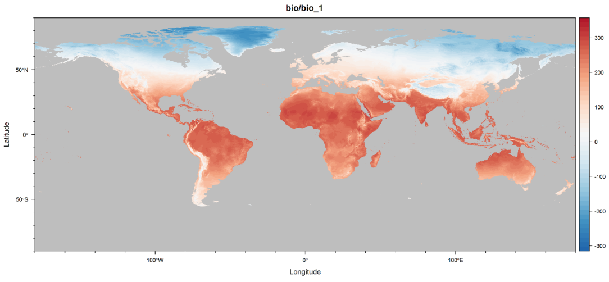

-------------

#### [Altitude (elevation above sea level) (m) (from SRTM)](alt.html)
#### [World monthly minimum temperature](tmin.html)
#### [World monthly maximum temperature](tmax.html)
#### [World monthly mean temperature](tmean.html)
#### [World monthly precipitation](tmean.html)

## Introduction
[WorldClim](www.worldclim.org) is a set of global climate layers (climate grids) with a spatial resolution of about 1 square kilometer. The data can be used for mapping and spatial modeling in a GIS or with other computer programs. 

Here, we want to visualize the WorldClim data to give research a direct reference.

Information about the methods used to generate the climate layers, and the units and formats of the data. You can find more info in the preferred citation:
> Hijmans, R.J., S.E. Cameron, J.L. Parra, P.G. Jones and A. Jarvis, 2005. Very high resolution interpolated climate surfaces for global land areas. International Journal of Climatology 25: 1965-1978.

## Data prepare
### Data download
Data for current conditions (~1950-2000) was downloaded from [http://worldclim.org/current](http://worldclim.org/current). WorldClim has four types of spatial resoluation data for download. Here, we visualized the 2.5 arc-minutes resolution.

**Four spatial resulations:**

- 30 arc-seconds (~1 km)
- 2.5 arc-minutes
- 5 arc-minutes
- 10 arc-minutes

**Available variables:**

- Min. Temperature: average monthly minimum  temperature (°C * 10)
- Max. Temperature: average monthly maximum temperature (°C * 10)
- Mean Temperature: average monthly mean temperature (°C * 10)
- Precipitation: average monthly precipitation (mm)
- Bioclim: bioclimatic variables derived from the tmean, tmin, tmax and prec
  - BIO1 = Annual Mean Temperature
  - BIO2 = Mean Diurnal Range (Mean of monthly (max temp - min temp))
  - BIO3 = Isothermality (BIO2/BIO7) (* 100)
  - BIO4 = Temperature Seasonality (standard deviation *100)
  - BIO5 = Max Temperature of Warmest Month
  - BIO6 = Min Temperature of Coldest Month
  - BIO7 = Temperature Annual Range (BIO5-BIO6)
  - BIO8 = Mean Temperature of Wettest Quarter
  - BIO9 = Mean Temperature of Driest Quarter
  - BIO10 = Mean Temperature of Warmest Quarter
  - BIO11 = Mean Temperature of Coldest Quarter
  - BIO12 = Annual Precipitation
  - BIO13 = Precipitation of Wettest Month
  - BIO14 = Precipitation of Driest Month
  - BIO15 = Precipitation Seasonality (Coefficient of Variation)
  - BIO16 = Precipitation of Wettest Quarter
  - BIO17 = Precipitation of Driest Quarter
  - BIO18 = Precipitation of Warmest Quarter
  - BIO19 = Precipitation of Coldest Quarter
- Altitude: altitude (elevation above sea level) (m) (from SRTM)

### Esri Grids to GeoTiff
We convert the orginal ESRI grids format to GeoTiff format with [`gdal_translate`](http://www.gdal.org/gdal_translate.html) tools.

## Visualiztion
We visualize these data with the help of R package named [`rasterVis`](https://github.com/oscarperpinan/rastervis).

